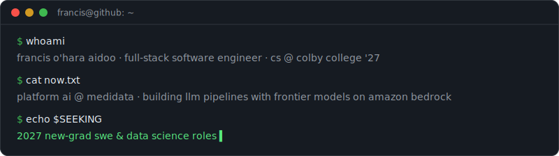
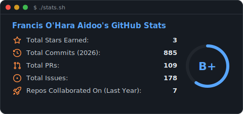
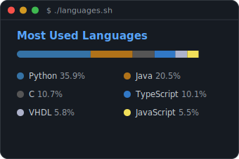

  

# Hi, I'm Francis 👋

I build full-stack software that makes AI useful, from frontend and backend to the pipelines underneath.

- 🎓 CS @ Colby College '27, AI concentration
- 🔭 Currently: Platform AI @ Medidata, building LLM pipelines with frontier models on Amazon Bedrock to extract structured data from clinical trial protocols
- 🎯 Looking for **2027 new-grad SWE & data science roles**
- 🌐 More at [francisohara.com](https://francisohara.com)

## Tech I work with

  
  
  
  
  
  
  
  
  
  
  
  
  
  
  
  
  
  
  

## What I've shipped

- **Terraform × Vertex AI (Google, 2025):** authored an [officially published Terraform resource](https://github.com/GoogleCloudPlatform/magic-modules/pull/14650) for deploying generative AI models from Model Garden. Public, documented, and in production for enterprises today.
- **Apache Beam CsvIO (Google, 2024):** built an Apache Beam transform capable of processing 3B+ CSV records an hour on Google Cloud Dataflow.
- **StyleSyncs (co-founder):** AI-powered fashion virtual try-on platform with 100+ users and $9K raised.
- **[Mule-Mart](https://github.com/Mule-Mart/Mule-Mart):** online marketplace for the Colby College community with AI-powered semantic search.

## GitHub stats

  
  

## How to reach me

[francisohara.com](https://francisohara.com) · [LinkedIn](https://linkedin.com/in/francis-ohara) · [franciskohara@gmail.com](mailto:franciskohara@gmail.com)
